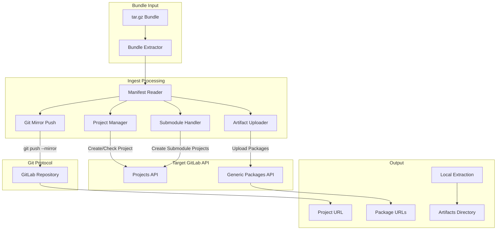

# Design Document: Air-Gap GitLab Ingest

## Overview

מערכת זו משלימה את airgap-pack ומאפשרת העלאת bundles לשרת GitLab ברשת air-gapped. המערכת:

1. פותחת את ה-tar.gz bundle
2. יוצרת פרויקט ב-GitLab אם לא קיים (דרך GitLab API)
3. מבצעת mirror push של כל ה-branches, tags, והיסטוריית הקומיטים
4. מעלה artifacts ל-GitLab Generic Packages Registry
5. מטפלת ב-submodules כפרויקטים נפרדים

התוצאה: הפרויקט נראה ברשת הסגורה כאילו פותח שם מלכתחילה.

## Architecture



## Components and Interfaces

### 1. Target GitLab Client (`target_gitlab_client.py`)

מודול חדש לתקשורת עם GitLab API ברשת הסגורה:

```python
from dataclasses import dataclass
from pathlib import Path
from typing import Literal

VisibilityLevel = Literal["private", "internal", "public"]

@dataclass
class TargetGitLabConfig:
    base_url: str          # e.g., "https://gitlab.internal.com"
    token: str             # Personal Access Token or Deploy Token

@dataclass
class ProjectInfo:
    id: int
    name: str
    path: str
    path_with_namespace: str
    http_url_to_repo: str
    web_url: str

@dataclass
class PackageInfo:
    package_id: int
    package_name: str
    version: str
    file_name: str
    download_url: str

class TargetGitLabClient:
    def __init__(self, config: TargetGitLabConfig): ...
    
    def project_exists(self, path_with_namespace: str) -> bool:
        """Check if a project exists at the given path."""
    
    def get_project(self, path_with_namespace: str) -> ProjectInfo | None:
        """Get project info by path, returns None if not found."""
    
    def create_project(
        self, 
        name: str, 
        namespace_id: int | None = None,
        visibility: VisibilityLevel = "private",
        description: str | None = None,
    ) -> ProjectInfo:
        """Create a new project in GitLab."""
    
    def get_namespace_id(self, namespace_path: str) -> int | None:
        """Get namespace ID from path like 'group/subgroup'."""
    
    def upload_package_file(
        self,
        project_id: int,
        package_name: str,
        version: str,
        file_path: Path,
        file_name: str | None = None,
    ) -> PackageInfo:
        """Upload a file to GitLab Generic Packages Registry."""
    
    def build_clone_url_with_token(self, project_path: str) -> str:
        """Build authenticated Git clone URL for pushing."""
```

### 2. Extended Ingest Command (`ingest.py`)

הרחבת הפקודה הקיימת עם פרמטרים חדשים:

```python
@app.command("ingest")
def ingest_command(
    # Existing parameters
    tar: Path = typer.Option(None, "--tar", exists=True, help="tar.gz bundle"),
    
    # Target GitLab parameters (new)
    target_gitlab_url: str | None = typer.Option(
        None, "--target-gitlab-url", 
        help="Target GitLab base URL"
    ),
    target_token: str | None = typer.Option(
        None, "--target-token", 
        envvar="TARGET_GITLAB_TOKEN",
        help="GitLab token for authentication"
    ),
    target_namespace: str | None = typer.Option(
        None, "--target-namespace",
        help="Namespace (group/subgroup) for the project"
    ),
    target_project_path: str | None = typer.Option(
        None, "--target-project-path",
        help="Full project path (overrides manifest repo_name)"
    ),
    visibility: str = typer.Option(
        "private", "--visibility",
        help="Project visibility: private, internal, or public"
    ),
    
    # Artifact parameters
    skip_artifacts: bool = typer.Option(
        False, "--skip-artifacts",
        help="Skip artifact upload to GitLab"
    ),
    artifacts_output_dir: Path | None = typer.Option(
        None, "--artifacts-output-dir",
        help="Also extract artifacts to local directory"
    ),
    
    # Submodule parameters
    submodule_mapping: Path | None = typer.Option(
        None, "--submodule-mapping",
        help="JSON file mapping submodule names to target paths"
    ),
    
    # Control parameters
    no_force: bool = typer.Option(
        False, "--no-force",
        help="Fail instead of force-push on diverged refs"
    ),
    dry_run: bool = typer.Option(
        False, "--dry-run",
        help="Simulate operations without making changes"
    ),
    
    # Legacy parameters (for backward compatibility)
    remote_template: str | None = typer.Option(
        None, "--remote-template",
        help="Legacy: URL template for push"
    ),
    username: str | None = typer.Option(None, "--username"),
    password: str | None = typer.Option(None, "--password"),
    mapping: Path | None = typer.Option(None, "--mapping"),
) -> None:
```

### 3. Project Manager (`project_manager.py`)

מודול לניהול יצירת ובדיקת פרויקטים:

```python
@dataclass
class IngestResult:
    project_info: ProjectInfo
    created: bool  # True if project was created, False if existed
    refs_pushed: int
    commits_pushed: int
    artifacts_uploaded: list[PackageInfo]
    submodules_processed: list[str]

class ProjectManager:
    def __init__(self, client: TargetGitLabClient, dry_run: bool = False): ...
    
    def ensure_project_exists(
        self,
        project_name: str,
        namespace: str | None,
        visibility: VisibilityLevel,
    ) -> tuple[ProjectInfo, bool]:
        """Ensure project exists, create if needed. Returns (info, was_created)."""
    
    def push_mirror(
        self,
        repo_dir: Path,
        project_info: ProjectInfo,
        force: bool = True,
    ) -> tuple[int, int]:
        """Push mirror to GitLab. Returns (refs_count, commits_count)."""
```

### 4. Artifact Uploader (`artifact_uploader.py`)

מודול להעלאת artifacts ל-GitLab:

```python
class ArtifactUploader:
    def __init__(self, client: TargetGitLabClient, dry_run: bool = False): ...
    
    def upload_artifacts(
        self,
        project_id: int,
        artifacts_dir: Path,
        manifest_artifacts: list[dict],
    ) -> list[PackageInfo]:
        """Upload all artifacts from bundle to GitLab packages."""
    
    def extract_artifacts(
        self,
        artifacts_dir: Path,
        output_dir: Path,
    ) -> tuple[int, int]:
        """Extract artifacts to local directory. Returns (count, bytes)."""
```

## Data Models

### Manifest Schema (Input)

הקלט מגיע מה-bundle שנוצר על ידי airgap-pack:

```json
{
  "repo_url": "https://gitlab.external.com/group/project.git",
  "repo_name": "project",
  "repo_path": "group/project",
  "source_gitlab_url": "https://gitlab.external.com",
  "created_at": "20241215T120000Z",
  "git_version": "git version 2.43.0",
  "with_submodules": true,
  "submodules": [
    {
      "path": "libs/common",
      "url": "https://gitlab.external.com/libs/common.git",
      "mirror": "submodules/common.git"
    }
  ],
  "with_artifacts": true,
  "artifacts": [
    {
      "job_id": 12345,
      "job_name": "build",
      "file_name": "artifacts.zip",
      "file_size": 1048576,
      "pipeline_id": 9876,
      "ref": "main"
    }
  ]
}
```

### Ingest Report Schema (Output)

דוח שנוצר בסיום ה-ingest:

```json
{
  "status": "success",
  "source_bundle": "project-20241215T120000Z.tar.gz",
  "target_gitlab_url": "https://gitlab.internal.com",
  "project": {
    "path_with_namespace": "internal-group/project",
    "web_url": "https://gitlab.internal.com/internal-group/project",
    "created": true
  },
  "git_push": {
    "refs_pushed": 15,
    "commits_pushed": 234,
    "force_pushed": false
  },
  "artifacts": [
    {
      "package_name": "build",
      "version": "9876",
      "download_url": "https://gitlab.internal.com/api/v4/projects/123/packages/generic/build/9876/artifacts.zip"
    }
  ],
  "submodules": [
    {
      "original_url": "https://gitlab.external.com/libs/common.git",
      "target_path": "internal-group/common",
      "target_url": "https://gitlab.internal.com/internal-group/common.git"
    }
  ],
  "duration_seconds": 45.2
}
```

### Submodule Mapping File Schema

קובץ אופציונלי למיפוי submodules:

```json
{
  "libs/common": "shared-libs/common",
  "vendor/external": "third-party/external"
}
```


## Correctness Properties

*A property is a characteristic or behavior that should hold true across all valid executions of a system-essentially, a formal statement about what the system should do. Properties serve as the bridge between human-readable specifications and machine-verifiable correctness guarantees.*

Based on the acceptance criteria analysis, the following correctness properties must be verified:

### Property 1: API Authentication Header

*For any* GitLab API request made by the TargetGitLabClient, the request SHALL include an authorization header with the provided token in the format `PRIVATE-TOKEN: {token}`.

**Validates: Requirements 1.2**

### Property 2: Project Creation When Missing

*For any* ingest operation where the target project does not exist, the system SHALL call create_project with the correct project name derived from the manifest.

**Validates: Requirements 2.1, 2.2**

### Property 3: Namespace Resolution

*For any* target namespace path provided, the system SHALL resolve it to a namespace_id and pass it to project creation.

**Validates: Requirements 2.3**

### Property 4: Visibility Parameter Propagation

*For any* visibility level provided (private, internal, public), the system SHALL pass this value to the project creation API.

**Validates: Requirements 2.5**

### Property 5: Target Path Override

*For any* target-project-path provided, the system SHALL use this path instead of the manifest repo_name for determining the project location.

**Validates: Requirements 3.1**

### Property 6: Path Parsing

*For any* target-project-path containing slashes, the system SHALL correctly split it into namespace and project-name components.

**Validates: Requirements 3.2**

### Property 7: Submodule Project Creation

*For any* bundle containing N submodules, the system SHALL create exactly N additional projects (one per submodule).

**Validates: Requirements 4.1**

### Property 8: Submodule Namespace Consistency

*For any* submodule upload, the submodule project SHALL be created in the same namespace as the main project.

**Validates: Requirements 4.2**

### Property 9: Submodule Mapping Application

*For any* submodule with an entry in the mapping file, the system SHALL use the mapped path instead of the default path.

**Validates: Requirements 4.3**

### Property 10: Artifact Upload Completeness

*For any* bundle containing N artifacts, the system SHALL attempt to upload exactly N packages to GitLab (unless skip_artifacts is True).

**Validates: Requirements 5.1**

### Property 11: Artifact Package Naming

*For any* artifact upload, the package_name SHALL equal the job_name and the version SHALL equal the pipeline_id from the artifact metadata.

**Validates: Requirements 5.2**

### Property 12: Artifact Upload Resilience

*For any* set of artifacts where some uploads fail, the system SHALL continue uploading remaining artifacts and not abort the entire operation.

**Validates: Requirements 5.5**

### Property 13: Artifact Extraction Structure Preservation

*For any* artifact file at path `artifacts/a/b/c` in the bundle, after extraction to output directory `D`, the file SHALL exist at path `D/a/b/c`.

**Validates: Requirements 5b.2**

### Property 14: Artifact Extraction Statistics

*For any* artifact extraction operation, the returned file count SHALL equal the actual number of files extracted, and the returned total size SHALL equal the sum of all extracted file sizes.

**Validates: Requirements 5b.3**

### Property 15: Existing Project No Recreation

*For any* ingest operation where the target project already exists, the system SHALL NOT call create_project.

**Validates: Requirements 6.1**

### Property 16: Force Push Default

*For any* git push operation where no_force is False, the push command SHALL include the force flag.

**Validates: Requirements 6.2**

### Property 17: No Force Flag Behavior

*For any* git push operation where no_force is True, the push command SHALL NOT include the force flag.

**Validates: Requirements 6.3**

### Property 18: Batch Processing Completeness

*For any* drop directory containing N tar.gz files, the system SHALL attempt to process all N bundles.

**Validates: Requirements 8.1**

### Property 19: Batch Processing Resilience

*For any* batch of bundles where some fail, the system SHALL continue processing remaining bundles.

**Validates: Requirements 8.2**

### Property 20: Parallel Processing Limit

*For any* parallel processing with limit N, at no point SHALL more than N bundles be processed concurrently.

**Validates: Requirements 8.4**

## Error Handling

### API Errors

| Error Condition | HTTP Status | Handling Strategy |
|----------------|-------------|-------------------|
| Invalid token | 401 | Exit with error: "Authentication failed. Check your TARGET_GITLAB_TOKEN" |
| Insufficient permissions | 403 | Exit with error listing required permissions (api, write_repository) |
| Project not found | 404 | Proceed to create project |
| Namespace not found | 404 | Exit with error: "Namespace '{path}' not found" |
| Rate limited | 429 | Retry with exponential backoff (max 3 retries) |
| Server error | 5xx | Retry up to 3 times, then fail with error |

### Git Push Errors

| Error Condition | Handling Strategy |
|----------------|-------------------|
| Remote rejected (non-fast-forward) | If no_force: fail with error. Otherwise: retry with --force |
| Authentication failed | Exit with error suggesting token verification |
| Repository not found | Exit with error (should not happen after project creation) |
| Network timeout | Retry up to 3 times |

### Bundle Errors

| Error Condition | Handling Strategy |
|----------------|-------------------|
| Invalid tar.gz format | Exit with error describing the issue |
| Missing manifest.json | Exit with error: "Bundle missing manifest.json" |
| Corrupted git repository | Exit with error: "Bundle contains corrupted git data" |
| Missing artifacts directory | Skip artifact upload, log info message |

## Testing Strategy

### Property-Based Testing Framework

The project will use **Hypothesis** for Python property-based testing. Each correctness property will be implemented as a Hypothesis test with a minimum of 100 iterations.

### Test File Structure

```
tests/
├── conftest.py                    # Shared fixtures and generators
├── test_target_gitlab_client.py   # Target GitLab client unit tests
├── test_project_manager.py        # Project manager tests
├── test_artifact_uploader.py      # Artifact upload tests
├── test_path_parsing.py           # Property tests for path parsing
├── test_ingest_integration.py     # Integration tests with mocked API
└── test_batch_processing.py       # Batch and parallel processing tests
```

### Property Test Annotations

Each property-based test MUST include a comment referencing the design document property:

```python
# **Feature: airgap-gitlab-ingest, Property 6: Path Parsing**
@given(
    namespace=st.text(alphabet=string.ascii_lowercase, min_size=1, max_size=20),
    project=st.text(alphabet=string.ascii_lowercase, min_size=1, max_size=20),
)
def test_path_parsing(namespace, project):
    path = f"{namespace}/{project}"
    parsed_ns, parsed_proj = parse_project_path(path)
    assert parsed_ns == namespace
    assert parsed_proj == project
```

### Test Generators (Hypothesis Strategies)

```python
from hypothesis import strategies as st

# GitLab URL generator
gitlab_urls = st.from_regex(r'https://gitlab\.[a-z]+\.(com|io|org|local)', fullmatch=True)

# Project name generator (valid GitLab project names)
project_names = st.from_regex(r'[a-z][a-z0-9_-]{0,99}', fullmatch=True)

# Namespace path generator
namespace_paths = st.from_regex(r'[a-z][a-z0-9_-]{0,49}(/[a-z][a-z0-9_-]{0,49}){0,2}', fullmatch=True)

# Visibility level generator
visibility_levels = st.sampled_from(["private", "internal", "public"])

# Artifact metadata generator
artifact_metadata = st.fixed_dictionaries({
    'job_id': st.integers(min_value=1),
    'job_name': st.from_regex(r'[a-z][a-z0-9_-]{0,49}', fullmatch=True),
    'file_name': st.just('artifacts.zip'),
    'file_size': st.integers(min_value=0, max_value=100_000_000),
    'pipeline_id': st.integers(min_value=1),
    'ref': st.from_regex(r'[a-z][a-z0-9_/-]{0,49}', fullmatch=True),
})

# Manifest generator
manifests = st.fixed_dictionaries({
    'repo_url': st.text(min_size=1),
    'repo_name': project_names,
    'created_at': st.from_regex(r'\d{8}T\d{6}Z', fullmatch=True),
    'with_artifacts': st.booleans(),
    'artifacts': st.lists(artifact_metadata, max_size=10),
    'with_submodules': st.booleans(),
    'submodules': st.lists(st.fixed_dictionaries({
        'path': st.text(min_size=1, max_size=50),
        'url': st.text(min_size=1),
        'mirror': st.text(min_size=1),
    }), max_size=5),
})
```

### Unit Tests

Unit tests will cover:
- CLI parameter parsing and validation
- Error message formatting
- GitLab API response parsing
- Path parsing and manipulation
- File system operations (with temporary directories)

### Integration Tests

Integration tests will use mocked HTTP responses (using `responses` or `httpx-mock`) to verify:
- Full ingest workflow with project creation
- Full ingest workflow with existing project
- Artifact upload workflow
- Submodule handling workflow
- Error handling scenarios
- Batch processing with mixed success/failure
