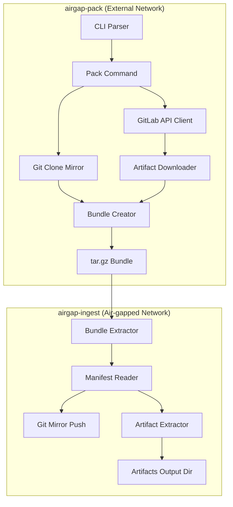

# Design Document: GitLab Private Source & Artifacts Support

## Overview

הרחבה זו מוסיפה תמיכה ב-GitLab פרטי כמקור ל-airgap-pack, כולל יכולת להוריד CI/CD artifacts. העיצוב מתבסס על הארכיטקטורה הקיימת ומרחיב אותה עם:

1. **GitLab Client Module** - מודול חדש לתקשורת עם GitLab API
2. **הרחבת Pack Command** - פרמטרים חדשים לאימות ו-artifacts
3. **הרחבת Ingest Command** - לוגיקה לחילוץ artifacts
4. **עדכון Manifest Schema** - הוספת מטא-דאטה על artifacts

## Architecture



## Components and Interfaces

### 1. GitLab API Client (`gitlab_client.py`)

מודול חדש לתקשורת עם GitLab API:

```python
@dataclass
class GitLabConfig:
    base_url: str          # e.g., "https://gitlab.mycompany.com"
    username: str | None
    token: str | None

@dataclass
class ArtifactInfo:
    job_id: int
    job_name: str
    file_name: str
    file_size: int
    pipeline_id: int
    ref: str

class GitLabClient:
    def __init__(self, config: GitLabConfig): ...
    
    def get_project_id(self, repo_path: str) -> int:
        """Get project ID from repo path like 'group/subgroup/project'"""
    
    def get_latest_successful_pipeline(self, project_id: int, ref: str | None) -> dict | None:
        """Get the latest successful pipeline for a ref (or default branch)"""
    
    def list_pipeline_jobs_with_artifacts(self, project_id: int, pipeline_id: int) -> list[dict]:
        """List all jobs in a pipeline that have artifacts"""
    
    def download_job_artifacts(self, project_id: int, job_id: int, output_path: Path) -> ArtifactInfo:
        """Download artifacts zip for a specific job"""
    
    def build_clone_url(self, repo_path: str) -> str:
        """Build authenticated Git clone URL"""
```

### 2. Extended Pack Command

הרחבת הפרמטרים ב-`pack.py`:

```python
@app.command("pack")
def pack_repo(
    # Existing parameters
    repo_url: str | None = typer.Option(None, "--repo-url", help="Git URL (for public repos)"),
    output: Path = typer.Option(...),
    repo_name: str | None = typer.Option(None),
    with_submodules: bool = typer.Option(False),
    
    # New GitLab private source parameters
    source_gitlab_url: str | None = typer.Option(None, "--source-gitlab-url", help="Private GitLab base URL"),
    repo_path: str | None = typer.Option(None, "--repo-path", help="Project path like group/project"),
    source_username: str | None = typer.Option(None, "--source-username", envvar="SOURCE_GITLAB_USERNAME"),
    source_token: str | None = typer.Option(None, "--source-token", envvar="SOURCE_GITLAB_TOKEN"),
    
    # Artifact parameters
    with_artifacts: bool = typer.Option(False, "--with-artifacts", help="Download CI/CD artifacts"),
    artifacts_ref: str | None = typer.Option(None, "--artifacts-ref", help="Branch/tag for artifacts"),
) -> None:
```

### 3. Extended Ingest Command

הרחבת הפרמטרים ב-`ingest.py`:

```python
@app.command("ingest")
def ingest_command(
    # Existing parameters
    tar: Path = typer.Option(...),
    remote_template: str = typer.Option(...),
    username: str | None = typer.Option(None),
    password: str | None = typer.Option(None),
    mapping: Path | None = typer.Option(None),
    
    # New artifact parameter
    artifacts_output_dir: Path | None = typer.Option(
        None, "--artifacts-output-dir", 
        help="Directory to extract artifacts to"
    ),
) -> None:
```

### 4. Artifact Extraction Logic

פונקציה חדשה ב-`ingest.py`:

```python
def extract_artifacts(bundle_root: Path, output_dir: Path) -> tuple[int, int]:
    """
    Extract artifacts from bundle to output directory.
    Returns (file_count, total_bytes).
    """
```

## Data Models

### Extended Manifest Schema

```json
{
  "repo_url": "https://gitlab.mycompany.com/group/project.git",
  "repo_name": "project",
  "repo_path": "group/project",
  "source_gitlab_url": "https://gitlab.mycompany.com",
  "created_at": "20241215T120000Z",
  "git_version": "git version 2.43.0",
  "with_submodules": true,
  "submodules": [...],
  "with_artifacts": true,
  "artifacts": [
    {
      "job_id": 12345,
      "job_name": "build",
      "file_name": "artifacts.zip",
      "file_size": 1048576,
      "pipeline_id": 9876,
      "ref": "main"
    }
  ]
}
```

### Bundle Directory Structure

```
project-20241215T120000Z.tar.gz
└── project/
    ├── project.git/           # Bare mirror
    ├── submodules/            # Optional submodule mirrors
    │   └── submod.git/
    ├── artifacts/             # New: CI/CD artifacts
    │   ├── build/
    │   │   └── artifacts.zip
    │   └── test/
    │       └── artifacts.zip
    └── manifest.json
```


## Correctness Properties

*A property is a characteristic or behavior that should hold true across all valid executions of a system-essentially, a formal statement about what the system should do. Properties serve as the bridge between human-readable specifications and machine-verifiable correctness guarantees.*

Based on the acceptance criteria analysis, the following correctness properties must be verified:

### Property 1: URL Construction Correctness

*For any* valid GitLab base URL, repo path, username, and token, the constructed clone URL SHALL follow the format `https://{username}:{token}@{host}/{repo_path}.git` where host is extracted from the base URL.

**Validates: Requirements 1.2, 1.3**

### Property 2: API Authentication Header

*For any* GitLab API request made by the client, the request SHALL include an authorization header with the provided token in the format `PRIVATE-TOKEN: {token}`.

**Validates: Requirements 2.2**

### Property 3: Ref Parameter in API Calls

*For any* specified artifacts ref, the pipeline query to GitLab API SHALL include the ref parameter to filter pipelines for that specific branch or tag.

**Validates: Requirements 2.4**

### Property 4: Artifact Storage Location

*For any* downloaded artifact, the artifact file SHALL be stored within the `artifacts/{job_name}/` directory inside the bundle root.

**Validates: Requirements 2.5**

### Property 5: Manifest Artifact Metadata Completeness

*For any* artifact included in a bundle, the manifest's artifacts array SHALL contain an entry with all required fields: job_id, job_name, file_name, file_size, and pipeline_id.

**Validates: Requirements 2.6, 5.1, 5.2**

### Property 6: Artifact Detection

*For any* bundle directory, the artifact detection function SHALL return true if and only if an `artifacts/` subdirectory exists within the bundle root.

**Validates: Requirements 3.1**

### Property 7: Artifact Extraction Completeness

*For any* bundle containing artifacts and a specified output directory, all files from the bundle's `artifacts/` directory SHALL be copied to the output directory.

**Validates: Requirements 3.2**

### Property 8: Artifact Structure Preservation

*For any* artifact file at path `artifacts/a/b/c` in the bundle, after extraction to output directory `D`, the file SHALL exist at path `D/a/b/c`.

**Validates: Requirements 3.4**

### Property 9: Extraction Statistics Accuracy

*For any* artifact extraction operation, the returned file count SHALL equal the actual number of files extracted, and the returned total size SHALL equal the sum of all extracted file sizes.

**Validates: Requirements 3.5**

### Property 10: Manifest JSON Round-Trip

*For any* valid manifest dictionary, serializing to JSON and then parsing back SHALL produce a dictionary equal to the original.

**Validates: Requirements 5.3, 5.4**

## Error Handling

### Pack Command Errors

| Error Condition | Handling Strategy |
|----------------|-------------------|
| `--source-gitlab-url` without `--repo-path` | Exit with error message explaining both are required |
| Invalid GitLab URL format | Exit with error message showing expected format |
| Authentication failure (401/403) | Exit with error message suggesting token verification |
| Project not found (404) | Exit with error message showing the attempted path |
| No successful pipeline found | Warning message, continue without artifacts |
| Artifact download failure | Warning message with details, continue with remaining artifacts |
| Network timeout | Retry up to 3 times, then warning and continue |

### Ingest Command Errors

| Error Condition | Handling Strategy |
|----------------|-------------------|
| Invalid bundle structure | Exit with error describing expected structure |
| Missing manifest.json | Exit with error message |
| Artifacts directory missing when expected | Info message, skip artifact extraction |
| Output directory not writable | Exit with error message |
| Disk space insufficient | Exit with error showing required vs available space |

## Testing Strategy

### Property-Based Testing Framework

The project will use **Hypothesis** for Python property-based testing. Each correctness property will be implemented as a Hypothesis test with a minimum of 100 iterations.

### Test File Structure

```
tests/
├── conftest.py              # Shared fixtures and generators
├── test_gitlab_client.py    # GitLab client unit tests
├── test_url_construction.py # Property tests for URL building
├── test_manifest.py         # Property tests for manifest serialization
├── test_artifact_extraction.py # Property tests for artifact handling
└── test_integration.py      # Integration tests with mocked API
```

### Property Test Annotations

Each property-based test MUST include a comment referencing the design document property:

```python
# **Feature: gitlab-private-source-artifacts, Property 1: URL Construction Correctness**
@given(
    base_url=gitlab_urls(),
    repo_path=repo_paths(),
    username=usernames(),
    token=tokens()
)
def test_url_construction_correctness(base_url, repo_path, username, token):
    ...
```

### Unit Tests

Unit tests will cover:
- CLI parameter parsing and validation
- Error message formatting
- Individual GitLab API response parsing
- File system operations (with temporary directories)

### Integration Tests

Integration tests will use mocked HTTP responses to verify:
- Full pack workflow with artifacts
- Full ingest workflow with artifact extraction
- Error handling scenarios

### Test Generators (Hypothesis Strategies)

```python
from hypothesis import strategies as st

# GitLab URL generator
gitlab_urls = st.from_regex(r'https://gitlab\.[a-z]+\.(com|io|org)', fullmatch=True)

# Repo path generator (group/subgroup/project format)
repo_paths = st.from_regex(r'[a-z]+(/[a-z]+){0,2}', fullmatch=True)

# Username generator
usernames = st.text(alphabet=st.characters(whitelist_categories=['L', 'N']), min_size=1, max_size=32)

# Token generator
tokens = st.text(alphabet=st.characters(whitelist_categories=['L', 'N', 'P']), min_size=20, max_size=64)

# Manifest generator
manifests = st.fixed_dictionaries({
    'repo_url': st.text(min_size=1),
    'repo_name': st.text(min_size=1),
    'created_at': st.text(min_size=1),
    'artifacts': st.lists(artifact_entries())
})
```
